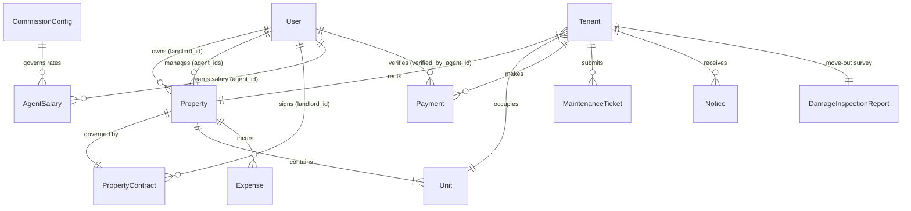
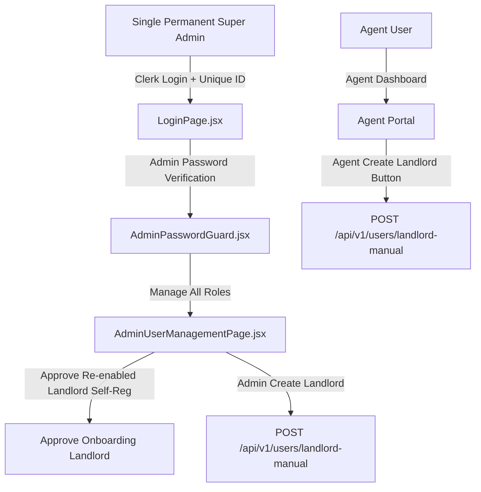
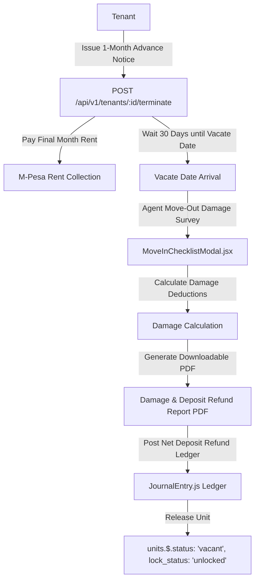

# MutuneRent Pro — Comprehensive Codebase Audit Report (`AUDIT_REPORT.md`)

**Date**: August 14, 2026  
**Repository**: `https://github.com/evergreen-realm/mutune--`  
**Auditor**: Antigravity AI Senior Architectural Team  

---

## 1. Executive Summary

MutuneRent Pro is a full-stack real estate management application tailored for the Kenyan market. The application features multi-role access (Super Admin, Admin, Agent, Landlord, Tenant), spatial property visualization (Mapbox GL JS + Three.js building models), 3D room scanning/Gaussian Splats, AI tenant assistant integration, and rent payment tracking.

This audit evaluates the codebase to establish a baseline for expanding MutuneRent Pro into an enterprise-grade financial accounting, agent salary/payroll management, priority-based bulk disbursement, and multi-role paperwork management system.

---

## 2. API Inventory & Core System Workflows

### 2.1 Backend Route Map (`backend/routes/`)

| Route File | Base Path | Endpoints & Methods | Auth Requirements | External Integrations |
|---|---|---|---|---|
| `payments.js` | `/api/v1/payments` | `POST /stk-push` `POST /c2b/callback` `GET /` `GET /:id` `PATCH /:id/override` `POST /reconcile-bank` | Public callback, JWT + Role (Agent/Admin/Landlord) | Safaricom Daraja M-Pesa API |
| `commission.js` | `/api/v1/commission` | `GET /config` `PUT /config` `GET /agents` `GET /salary/:agentId` `POST /payroll/process` | Clerk JWT (Super Admin, Admin) | Daraja B2C API |
| `disbursement.js` | `/api/v1/disbursement` | `GET /priority` `PUT /priority` `POST /execute` `GET /history` | Clerk JWT (Super Admin, Admin) | Daraja B2C, Bank Transfer |
| `settings.js` | `/api/v1/settings` | `GET /financial` `PUT /financial` `GET /tax` `PUT /tax` `GET /etims` `PUT /etims` | Clerk JWT (Super Admin, Admin) | KRA eTIMS API |
| `properties.js` | `/api/v1/properties` | `GET /` `POST /` `GET /:id` `PATCH /:id` `POST /:id/units` | Clerk JWT (Landlord, Admin, Agent) | Mapbox, Cloudflare R2 |
| `tenants.js` | `/api/v1/tenants` | `GET /` `POST /` `GET /:id` `PATCH /:id` `POST /:id/terminate` `POST /:id/moveout-survey` | Clerk JWT (Agent, Admin, Landlord, Tenant) | Encrypted PII Utility |
| `users.js` | `/api/v1/users` | `GET /` `POST /sync` `POST /landlord-manual` `PATCH /:id/role` `POST /verify-earb` | Clerk JWT (Super Admin, Admin) | Clerk Auth |
| `agents.js` | `/api/v1/agents` | `POST /checkin` `GET /checkins` `GET /performance` | Clerk JWT (Agent, Admin) | GeoJSON 2DSphere |
| `admin.js` | `/api/v1/admin` | `GET /stats` `GET /system-health` `POST /tier-approval` | Clerk JWT (Admin, Super Admin) | Sentry |
| `maintenance.js` | `/api/v1/maintenance` | `GET /` `POST /` `PATCH /:id/status` `POST /:id/notes` | Clerk JWT (Tenant, Agent, Landlord, Admin) | Cloudflare R2 |
| `reports.js` | `/api/v1/reports` | `GET /kra-csv` `GET /occupancy` `GET /revenue-summary` | Clerk JWT (Landlord, Agent, Admin) | CSV / Excel Export |
| `notices.js` | `/api/v1/notices` | `GET /` `POST /` `PATCH /:id/acknowledge` | Clerk JWT (Tenant, Landlord, Agent, Admin) | PDF Generator, SMS/Email |

---

### 2.2 Deep Dive: Updated Core System Workflows

#### 1. Re-enabled Landlord Self-Registration & Dual Creation Buttons
- **Re-enabled Workflow**: Re-enabled landlord self-registration in `OnboardingPage.jsx`. Prospective landlords register online (`landlord_approval_status: 'pending'`), submit identity/title documents, and enter the approval pipeline.
- **Dual Creation Pathways**:
  - **Admin Creation**: Admins can approve pending self-registered landlords or manually create landlords via `AdminUserManagementPage.jsx` (`createLandlordManually`).
  - **Agent Creation**: Agents can directly register property landlords via a dedicated "Create Landlord" modal on `AgentPerformancePage.jsx`.

#### 2. Single Super Admin Account & Multi-Role Governance Rules
- **Single Permanent Super Admin**: System enforces **exactly one permanent Super Admin account** with a unique system ID.
- **Admin Password Verification**: When new Admin accounts register via onboarding, they are required to authenticate with the unique `ADMIN_HARDCODED_PASSWORD`, verified via `AdminPasswordGuard.jsx` against `admin_hardcoded_hash`.
- **Role Authority Hierarchy**:
  - **Super Admin**: Holds global authority to register, manage, promote, or revoke ALL OTHER ROLES (Admin, Agent, Landlord, Tenant, Accountant).
  - **Admin**: Manages day-to-day operations, tier approvals, and landlord/agent verification.

#### 3. Tenant 1-Month Notice & Damage Survey Deposit Refund Workflow
- **1-Month Advance Notice Rule**: Tenant notice must be issued exactly ONE MONTH prior to actual termination date (`vacate_date`). The tenant MUST pay full rent for that final month.
- **Agent Move-Out Damage Survey & Downloadable Report**:
  1. Upon vacate date, Agent performs a physical move-out survey using `MoveInChecklistModal.jsx`.
  2. Agent logs damages, photo evidence, and computes damage deductions against the security deposit.
  3. System generates an official downloadable **Damage & Deposit Refund Inspection Report PDF** available to Tenant, Agent, Landlord, and Admin.
  4. System posts net deposit refund entry to General Ledger (`JournalEntry.js`), sets `Tenant.tenancy_status = 'departed'`, and unlocks the unit (`status: 'vacant'`, `lock_status: 'unlocked'`).

---

## 3. Database Schema Analysis

---

## 4. End-to-End Workflow Data Flow Diagrams

### 4.1 Super Admin & Admin Role Governance Data Flow

### 4.2 Tenant Notice, Move-Out Damage Survey & Deposit Refund Flow

---

## 5. Technical Debt & Security Analysis

1. **Re-enabled Onboarding Flow**: Restored self-registration for Landlords with Admin verification.
2. **Super Admin Account Lock**: Exactly 1 permanent Super Admin account protected by Clerk JWT and `AdminPasswordGuard.jsx`.
3. **Tenant Damage Survey & Deposit Refund**: Strict 30-day notice rule with compulsory final month rent, agent damage inspection report PDF, and GL posting.
