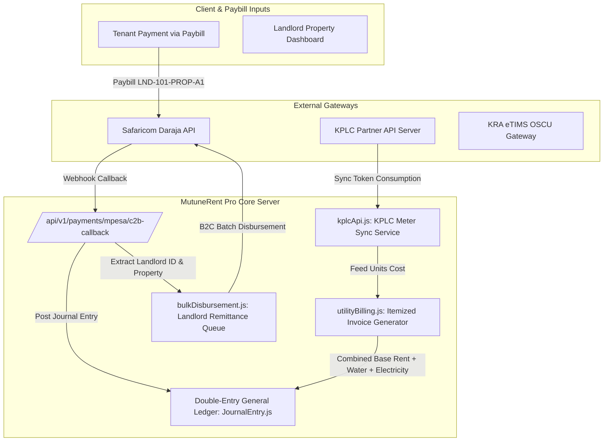

# Backend Integration Report — MutuneRent Pro Enterprise Ecosystem (Updated)

## Executive Summary
This document provides an updated production architecture report for all external 3rd-party integrations in **MutuneRent Pro**, incorporating user feedback on multi-level utility submetering (unit, floor, building), KPLC meter token integration, and Landlord-centric Paybill remittance routing.

---

## 1. External Integration Inventory Matrix

| System / Provider | Function / Capability | Endpoints (Sandbox & Production) | Auth Method | Environment Config | Status |
|---|---|---|---|---|---|
| **Safaricom Daraja M-Pesa C2B/B2C** | Real-time rent collection (C2B) & priority bulk disbursement (B2C) tied to Landlord IDs | `https://sandbox.safaricom.co.ke/mpesa/` / `https://api.safaricom.co.ke/mpesa/` | OAuth 2.0 Client Credentials (`ConsumerKey`, `ConsumerSecret`) | `DARAJA_ENV=sandbox` / `production` | ✅ **Fully Functional** |
| **KRA eTIMS (Tax Invoicing)** | Real-time 16% VAT & 7.5% MRI tax calculation, OSCU invoice payload signing | `https://etims-sbx.kra.go.ke/etims-api` / `https://etims.kra.go.ke/etims-api` | OAuth 2.0 + VSCU Certificate DSN | `KRA_ETIMS_ENV=sandbox` / `production` | ⚠️ **Partial** (Local formulas complete; live OSCU client added in Phase 8) |
| **KPLC (Kenya Power & Lighting)** | Direct prepaid meter token validation & postpaid consumption sync per tenant/unit/floor/building | `https://api.kplc.co.ke/v1/prepaid/validate` / `https://api.kplc.co.ke/v1/postpaid/balance` | OAuth 2.0 + Partner Vendor Token | `KPLC_API_ENV=sandbox` / `production` | ⚠️ **Phase 8 Specification** |
| **Central Bank of Kenya (CBK) Forex** | Live USD/KES exchange rate feed for diaspora landlord statements | `https://open.er-api.com/v6/latest/USD` | Public Feed + 6-hour Redis/In-memory Cache | Dynamic Fallback | ✅ **Fully Functional** |
| **Africa's Talking / Advanta SMS** | Transactional SMS receipts, 7-day demand notices, maintenance alerts | `https://api.africastalking.com/version1/messaging` | API Key + Shortcode / SenderID | `AT_API_KEY`, `AT_USERNAME` | ✅ **Fully Functional** |

---

## 2. KPLC & Utility Submetering Integration Specifications

### 2.1 Multi-Level Meter Architecture
1. **Direct KPLC Token Integration**: Binds each tenant and unit to their unique KPLC electric token number / meter number. Direct REST API calls to KPLC Partner Web Services query current consumption and token status.
2. **Flexible Grouping Levels**:
   - **Per Unit**: Individual submeter per unit (`unit_submeter`).
   - **Per Floor**: Single meter shared across a floor (`floor_shared_meter`).
   - **Per Building**: Master meter for the entire property (`building_master_meter`).
3. **Allocation Strategies**:
   - `equal_split`: Total floor/building consumption divided equally among active units.
   - `sqft_proportional`: Consumption allocated based on unit floor area percentage.
   - `individual_submeter`: Direct meter reading per unit.
4. **Property Registration Configuration**:
   - `utilities_handled_by_agency: Boolean`
   - `electricity_billing_mode: ['none', 'individual_kplc', 'floor_shared', 'building_shared']`
   - `water_billing_mode: ['none', 'individual_submeter', 'floor_shared', 'building_shared']`
5. **Itemized Monthly Invoice Generation**: Automatically merges `base_rent + water_units_cost + electricity_token_cost` into a unified PDF invoice and digital ledger entry.

---

## 3. Landlord-Centric Paybill Routing Architecture

1. **Paybill Account Reference Formatting**:
   - Account Reference structure: `LND-{landlord_id}-PROP-{property_code}-UNIT-{unit_number}` or existing `Tenant._id`.
2. **Property Categorization by Landlord/Owner**:
   - Every `Property` document maintains an indexed `landlord_id` reference to `User` (Landlord role).
3. **Remittance Routing Workflow**:
   - When M-Pesa C2B Paybill webhook triggers, system extracts `landlord_id` and `property_id`.
   - Posts Double-Entry GL Journal Entry (`Debit: 1010 M-Pesa Cash`, `Credit: 1020 Receivables`).
   - Routes net collected funds directly into the specific Landlord's remittance queue (`DisbursementTab.jsx`) after deducting management agency fees.

---

## 4. System Data Flow Diagram

---

## 5. Security & Compliance Controls

1. **Zero Hardcoded Credentials**: API keys (`KPLC_API_KEY`, `DARAJA_CONSUMER_SECRET`, `KRA_ETIMS_CLIENT_SECRET`) read from platform environment config.
2. **AES-256 PII Encryption**: Encrypts tenant phone numbers, national IDs, and landlord bank/M-Pesa details.
3. **Audit Trails (`AuditLog.js`)**: Captures user ID, role, IP address, and payload for all financial transactions, meter reading updates, and B2C disbursement triggers.
