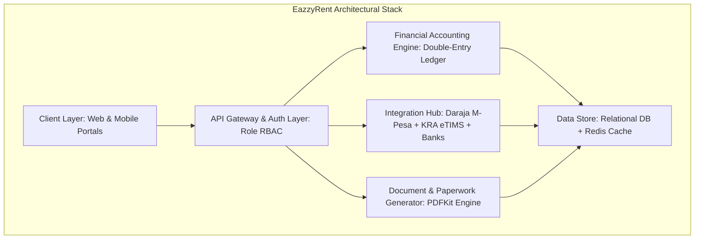

# Competitor Architectural Review: EazzyRent Pro

## Executive Overview
**EazzyRent** (and its market peers in Kenya like Pangoni and Silqu) is a leading cloud-based property management and financial automation platform tailored for the Kenyan real estate ecosystem. It serves property managers, landlords, estate agents, and tenants by digitizing property operations, rent collection, financial ledgers, legal documentation, and tax reporting.

---

## 1. Core Architectural Pillars

### 1.1 Tenant & Property Data Architecture
- **Hierarchical Entity Model**: `Landlord -> Property -> Building Block -> Floor -> Unit -> Tenancy Contract -> Tenant`.
- **Tenant Code Binding**: Every tenant is assigned a unique immutable identifier (e.g., `TNT-8849`). This code acts as the primary key for M-Pesa Paybill AccountReference matching.

### 1.2 Financial Accounting Subsystem
- **Double-Entry General Ledger**: Operates a strict Chart of Accounts (Assets, Liabilities, Equity, Revenue, Expenses).
- **Automated Accrual & Cash Basis Accounting**: Rent charges accrue on the 1st of every month (`Debit: Accounts Receivable (1020)`, `Credit: Rental Income (4010)`). When rent is collected via M-Pesa/Bank, cash is debited and receivable is credited (`Debit: M-Pesa Cash (1010)`, `Credit: Accounts Receivable (1020)`).

---

## 2. Eliminated Paper Workflows & Digital Substitutes

| Traditional Paper Workflow | Flaws & Vulnerabilities in Paper Process | Digital Production Substitute (EazzyRent) | Value Add & Production Benefits |
|---|---|---|---|
| **Carbon-Copy Paper Lease Agreements** | Lost in filing cabinets; altered terms; missing mandatory Kenyan Landlord & Tenant Act (Cap 301) clauses; unverified witness signatures. | **Automated Legal PDF Lease Generator**: Digital OTP signature verification, immutable SHA-256 hash stamp, stored in cloud R2 storage. | 100% legal enforceability in Kenyan courts; zero paper storage cost; instant retrieval. |
| **Handwritten Receipt Books & Bank Counterfoils** | Fraudulent receipt issuance by caretakers; lost receipts during audit; manual data entry errors. | **Instant M-Pesa C2B Paybill Webhook & SMS Receipt**: Real-time callback processing (STK / C2B) with instant SMS delivery via Africa's Talking. | Eliminates receipt fraud; 98%+ automated payment reconciliation; 0-minute lag. |
| **Physical 7-Day Demand Notes & Eviction Notices** | Disputed delivery proof in Rent Restriction Tribunal (RRT); manual late fee calculations; delays in legal action. | **Automated 7-Day Demand Note Engine**: System auto-calculates grace periods & late fee rules, generates PDF demand note, and logs trackable delivery. | Adheres strictly to Kenyan distress for rent legal timelines; verifiable delivery log. |
| **Paper Cheques & Manual Remittance Slips** | 10-15 day delay in landlord payouts; manual cheque clearing fees; fraud risks. | **Priority Bulk B2C Disbursement**: Automated batch execution (Landlords → Agents → Suppliers → Staff → Deposit Refunds) via Safaricom B2C API. | Same-day landlord payouts; dual KES/USD currency statements with live CBK rates. |
| **Paper Move-In / Move-Out Inspection Checklists** | Disputed security deposit deductions; missing baseline photos; deposit refund litigation. | **Digital Photographic Damage Survey**: Mobile camera inspection checklist with itemized repair costs and net deposit calculation. | Prevents deposit disputes; automated GL deposit refund posting; automatic unit unlock. |
| **Manual Paper KRA Tax Returns (MRI & VAT)** | High audit penalties; inaccurate 7.5% MRI and 5% WHT calculations; tedious manual iTax entry. | **Direct eTIMS Control Unit Integration**: Real-time 16% VAT & 7.5% MRI payload compilation with multi-sheet KRA CSV/Excel export. | Guaranteed KRA tax compliance; zero penalty risk; 1-click tax filing. |

---

## 3. Third-Party Integration Matrix

1. **Safaricom Daraja API (C2B & B2C)**:
   - *C2B Paybill/Till*: Real-time webhook processing for rent collections.
   - *B2C Bulk Payouts*: Automated batch disbursements for landlord remittances, agent commissions, and supplier payouts.
2. **KRA eTIMS (Electronic Tax Invoice Management System)**:
   - Virtual Control Unit (VSCU) / OSCU REST API payload signing.
3. **SMS Gateways (Africa's Talking / Advanta)**:
   - Automated rent reminders, payment receipts, and notice alerts.
4. **Banking APIs (KCB, Equity Bank, Co-op Bank)**:
   - Host-to-Host (H2H) direct bank statement reconciliation feeds.

---

## 4. Architectural Flaws & Failure Modes in Competitor Systems

1. **Rigid M-Pesa Paybill Reconciliations**: When tenants pay via third-party M-Pesa numbers (e.g. spouse or employer), auto-matching fails, filling the unmatched queue without intelligent fuzzy matching.
2. **Missing Live CBK Forex Updates**: Competitors hardcode static USD exchange rates, causing financial variance on diaspora landlord statements.
3. **Context Context Loss in Mobile Views**: Many competitors wrap desktop views in responsive webviews without optimizing WebGL/Mapbox dynamic renders, crashing lower-end mobile devices.
