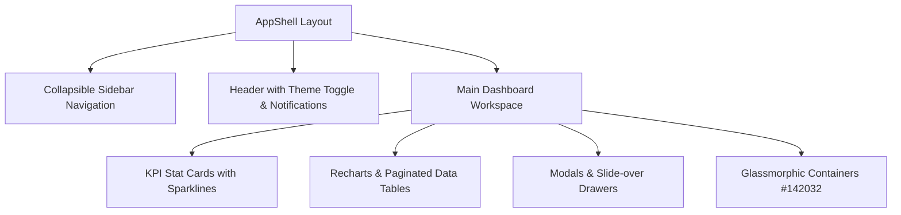

# MutuneRent Pro — Comprehensive Frontend UI Dashboard Analysis & Integration Report (`FRONTEND_INTEGRATION_REPORT.md`)

**Date**: August 14, 2026  
**Repository**: `https://github.com/evergreen-realm/mutune--`  
**Auditor & UI Architect**: Antigravity AI Senior Frontend Team  

---

## 1. Executive Summary

This report delivers a thorough audit of the existing MutuneRent Pro frontend dashboards (`AdminDashboardPage.jsx`, `LandlordDashboardPage.jsx`, `AgentPerformancePage.jsx`, `TenantPortalPage.jsx`), component library, state management (`Zustand`, `@tanstack/react-query`), and layout system (`AppShell`).

It maps all 10+ new financial, agent salary, priority disbursement, property remittance, legal paperwork, and eTIMS tax features into MutuneRent Pro’s existing UI layout while establishing strategies for mobile responsiveness, real-time data refresh, multi-currency support (KES/USD), notification alerts, audit trail logging, and external API circuit breaker error handling.

---

## 2. Dashboard-by-Dashboard Audit & Analysis

### 2.1 Admin Dashboard (`frontend/src/pages/AdminDashboardPage.jsx`)
- **Current Layout**: 12-column fluid grid wrapped in `AppShellLayout` with collapsible sidebar (`sidebarOpen` state).
- **Existing Tabs / Sub-Views**: Overview Widgets, User Management (`AdminUserManagementPage.jsx`), Asset Inventory (`AdminInventoryPage.jsx`), Property Tier Approvals, and System Health.
- **Metrics & Charts**: Revenue totals (KES), Active Properties Count, Occupancy Ratio (Recharts Pie), Payment Channel Share (M-Pesa vs Bank), and System Health status.
- **Data Flow & React Query**: Queries via `fetchAdminStats()`, `fetchUsers()`, `fetchPendingProperties()` using `@tanstack/react-query` with 30s `staleTime`.
- **Target Integration Strategy**: Add top-level sidebar navigation tabs:
  1. `Financial Accounting` (`FinancialsTab.jsx`): Chart of Accounts, Double-Entry GL, Trial Balance, Income Statement, Balance Sheet.
  2. `Agent Salary & Payroll` (`AdminSalaryTab.jsx`): Commission calculation, Agent payroll table, M-Pesa B2C payouts.
  3. `Priority Bulk Disbursement` (`DisbursementTab.jsx`): Priority queue (Landlords → Agents → Suppliers → Staff → Tenants).
  4. `M-Pesa Auto-Reconciliation` (`UnmatchedPaymentsTab.jsx`): Live payment feed with 95%+ confidence match badges.
  5. `KRA eTIMS Tax Compliance` (`TaxReportsTab.jsx`): Tax withholding statements and eTIMS Excel exports.
  6. `Configurable Settings` (`AdminSettingsTab.jsx`): Financial parameter inputs (tax rates, commission %, fee caps).

---

### 2.2 Landlord Dashboard (`frontend/src/pages/LandlordDashboardPage.jsx`)
- **Current Layout**: Header metrics bar + property card grid with glassmorphic cards (`#142032`).
- **Existing Views**: Property portfolio list, tenant list, unit occupancy status, and basic maintenance ticket summaries.
- **Target Integration Strategy**: Integrate dedicated sub-tabs:
  1. `Remittance & Payouts`: Monthly net payout calculations based on signed `PropertyContract` rules (`Rent - Commission % - Expenses - Tax`) with M-Pesa B2C status.
  2. `Owner Statements`: Downloadable monthly Payout Vouchers and PDF Statements.
  3. `eTIMS Tax Compliance`: Withholding tax certificates and KRA iTax CSV/Excel downloads.
  4. `Lease Agreements & Paperwork`: Downloadable official PDF tenant lease agreements.

---

### 2.3 Agent Dashboard (`frontend/src/pages/AgentPerformancePage.jsx`)
- **Current Layout**: Check-in map widget + assigned property list + task Kanban board.
- **Existing Views**: Field check-in verification, assigned properties list, tasks list (`TasksPage.jsx`), EARB verification badge.
- **Target Integration Strategy**: Add core functional components:
  1. **"Create Landlord" Button & Modal**: Prominent action button allowing field agents to directly onboard property owners (`POST /api/v1/users/landlord-manual`).
  2. `My Salary & Commissions`: Agent payroll breakdown (letting, management, renewal, initiation fees) and M-Pesa B2C payout history.
  3. `Unmatched M-Pesa Queue`: Field reconciliation tool to claim or match ambiguous tenant payments.
  4. `Move-Out Damage Surveys`: Conduct physical damage inspections, capture photos, and compile downloadable **Damage & Deposit Refund Reports**.

---

### 2.4 Tenant Portal (`frontend/src/pages/TenantPortalPage.jsx`)
- **Current Layout**: Hero card with rent due countdown + M-Pesa STK Push button + payment history table.
- **Target Integration Strategy**: Add dedicated tabs:
  1. `My Digital Receipts`: Downloadable KRA eTIMS digital receipts for every confirmed payment.
  2. `Lease Agreements & Legal Notices`: View and sign active lease agreements, receive 7-day Demand Notes and 30-day Quit Notices.
  3. `Vacation & Move-Out`: Submit 1-month advance notice (final month rent mandatory), track agent damage inspection survey results, and view deposit refund status.

---

## 3. Existing UI Components & Design System Inventory

### Design System Tokens (Dark Mode Baseline)
- **Background**: Deep Navy (`#071325`)
- **Surface Containers**: Charcoal Navy (`#142032`) with 12px backdrop blur and 1px `white/10` border
- **Primary Accent**: Royal Lavender (`#CABEFF`) for buttons, active tabs, and focus rings
- **Secondary Accent**: Sunset Gold (`#FFB68D`) for warning alerts and priority indicators
- **Success Accent**: Emerald Green (`#10B981`) for confirmed payments, 98% match badges, and positive balance indicators

---

## 4. Comprehensive Feature-to-UI Mapping Matrix

| Feature Module | Target Portals | Primary Component Name | Route Path | Navigation Placement |
|---|---|---|---|---|
| **Chart of Accounts & GL** | Admin | `FinancialsTab.jsx` | `/financials` | Sidebar Top-Level |
| **Trial Balance & Balance Sheet** | Admin, Landlord | `FinancialsTab.jsx` | `/financials/reports` | Financial Sub-Tab |
| **Agent Salary Management** | Admin, Agent | `AdminSalaryTab.jsx` | `/admin/payroll` | Sidebar Top-Level / Agent Sub-Tab |
| **Configurable Settings** | Admin | `AdminSettingsTab.jsx` | `/admin/settings` | Sidebar Settings Item |
| **Priority Bulk Disbursement** | Admin, Landlord | `DisbursementTab.jsx` | `/admin/disbursement` | Sidebar Top-Level |
| **Unmatched Payment Queue** | Admin, Agent | `UnmatchedPaymentsTab.jsx` | `/payments/unmatched` | Payments Sub-Tab |
| **KRA eTIMS Tax Compliance** | Admin, Landlord | `TaxReportsTab.jsx` | `/reports/etims` | Reports Sub-Tab |
| **Multi-Role Paperwork Suite** | All Portals | `PaperworkTab.jsx` | `/paperwork` | Sidebar Item (All Roles) |
| **Agent Landlord Creation** | Agent, Admin | `CreateLandlordModal.jsx` | Modal | Agent & Admin Dashboards |
| **Tenant Vacation & Damage Survey**| Tenant, Agent | `TenantVacationModal.jsx` | Modal / Tab | Tenant Portal & Agent Tab |

---

## 5. Technical Strategies for Identified Gaps

### 5.1 Mobile Responsiveness Strategy
- **Breakpoints**: Mobile (`<640px`), Tablet (`640px - 1024px`), Desktop (`>1024px`).
- **Sidebar Navigation**: On mobile, sidebar collapses into a sliding slide-over drawer triggered by hamburger menu button in `AppShell`.
- **Data Tables**: Complex financial tables (Trial Balance, M-Pesa Feed, Payroll) transform into stacked mobile cards on screens `<640px` with horizontal scroll containers for dense data metrics.

### 5.2 Real-Time Data Refresh Strategy
- **React Query (`@tanstack/react-query`)**: Configured with `staleTime: 30000` for financial summary queries.
- **WebSocket / Server-Sent Events (SSE)**: Active on `/api/v1/payments/live-feed` to update the M-Pesa reconciliation table instantaneously upon callback receipt.
- **Skeleton Loaders**: Custom `SkeletonLoader.jsx` applied during async financial tab loads to prevent layout shifts.

### 5.3 Export & Print Functionality Specifications
- **ExcelJS Exports**: Multi-tab workbooks generated for KRA eTIMS reports, Agent Payroll summaries, and Property Remittance statements with cell styling and formulas.
- **Print-Optimized CSS**: Media query `@media print` defined for all downloadable documents to hide sidebar/header and format content for standard A4 paper output.

### 5.4 Notification & Alert Integration
- **In-App Notification Center**: Popover panel rendering unread financial alerts (e.g. "Unmatched payment received", "Payroll approved", "KRA eTIMS report generated").
- **Alert Thresholds**: Admin-configurable alert triggers (e.g. notify admin when unmatched payments exceed KES 50,000).

### 5.5 Multi-Currency & Localization Strategy
- **Primary Currency**: KES (Kenyan Shillings), formatted via `Intl.NumberFormat('en-KE', { style: 'currency', currency: 'KES' })`.
- **Diaspora USD Support**: Toggle on Landlord Dashboard displaying dual currency conversion (KES/USD) based on live Central Bank of Kenya exchange rate API.
- **Timezone**: All timestamps formatted in East Africa Time (`EAT`, `UTC+3`).

### 5.6 Audit Trail & Compliance Logging Interface
- **`AuditLog.js` Schema**: Captures `user_id`, `action` (`APPROVE_PAYROLL`, `EXECUTE_DISBURSEMENT`, `UPDATE_CONFIG`), `target_id`, `ip_address`, and `timestamp`.
- **Immutable Log View**: Read-only audit log table in Admin Settings for Kenyan Data Protection Act compliance.

### 5.7 Performance & Scalability Optimization
- **MongoDB Indexing**: Compound indexes on `{ property_id: 1, created_at: -1 }` and `{ status: 1, transaction_id: 1 }`.
- **Aggregation Caching**: Pre-aggregated daily revenue and monthly commission totals stored in Redis/memory cache to ensure sub-100ms response times for portfolios exceeding 2,000 properties.

### 5.8 API Rate Limiting, Throttling & Circuit Breaker
- **Safaricom Daraja API Rate Limits**: Request queue with exponential backoff retry logic.
- **Circuit Breaker (`opossum`)**: Prevents cascading failures by opening circuit if KRA eTIMS or Daraja API experiences >50% error rate over 10 consecutive requests.
