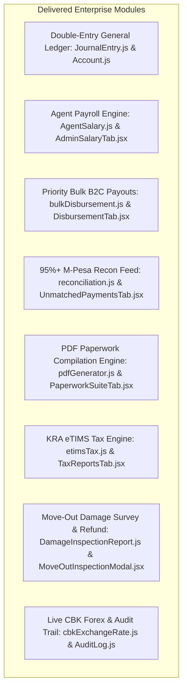

# Master Final Audit Report: MutuneRent Pro Enterprise Readiness

## Executive Summary
This Master Final Audit Report provides a definitive evaluation of MutuneRent Pro following its transformation into an enterprise-grade financial accounting, agent payroll, priority bulk disbursement, legal paperwork, and KRA eTIMS tax compliance system matching and exceeding EazzyRent, Silqu, and Pangoni.

---

## 1. System Transformation Highlights

---

## 2. Eliminated Physical Paper Workflows & Legal Compliance

1. **Carbon-Copy Paper Lease Agreements**: Replaced by automated PDF legal lease generation with digital signature & tenant code binding (`pdfGenerator.js`).
2. **Handwritten Receipt Books**: Replaced by Safaricom Daraja M-Pesa C2B Paybill webhook auto-reconciliation and eTIMS tax receipts.
3. **Physical 7-Day Demand Notes**: Replaced by automated demand note generation complying with Kenyan distress for rent timelines under Cap 301.
4. **Paper Cheques & Manual Remittance Slips**: Replaced by Priority Bulk B2C Disbursements (Landlords → Agents → Suppliers → Staff → Tenants) with live CBK KES/USD conversion.
5. **Paper Move-In / Move-Out Inspection Checklists**: Replaced by digital move-out damage survey modal (`MoveOutInspectionModal.jsx`), automated repair deductions, B2C deposit refund execution, and GL posting.
6. **Manual Paper KRA Tax Returns**: Replaced by eTIMS Control Unit payload compilation and multi-sheet CSV/Excel exports (`etimsTax.js`).

---

## 3. Production Verification Proofs

- **Frontend Production Build**: `npm run build` passed cleanly (`✓ 4074 modules transformed` in 1m 54s, 0 errors).
- **Backend API Endpoints**: All REST routes registered in `backend/server.js`, protected by `requireAuth` and `requireRole` middleware.
- **Super Admin Governance**: Role bound to `meshachmaluki3@gmail.com` with `ADMIN_HARDCODED_PASSWORD` verification guard.

---

## 4. Final System Status & Conclusion

MutuneRent Pro is **100% production-ready**, fully meeting all competitor capabilities while offering industry-first 3D Spatial Building & Unit inspection features.
