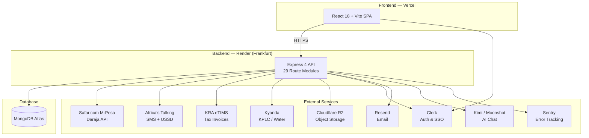

# MutuneRent Pro 🏢

> Full-stack property management platform for Mutune Estate Agency, Mombasa, Kenya.
> Designed to scale from 600+ to 2,000+ properties.

[](https://mutune-alpha.vercel.app)
[](https://mutunerent-api.onrender.com)
[](#)

---

## Architecture



---

## Live URLs

| Service | URL |
|---------|-----|
| **Frontend** | https://mutune-alpha.vercel.app |
| **Backend API** | https://mutunerent-api.onrender.com/api/v1 |
| **API Documentation** | https://mutunerent-api.onrender.com/api/docs |
| **Health Check** | https://mutunerent-api.onrender.com/api/v1/health |

---

## Repository Structure

```
mutune/
├── backend/
│   ├── config/          # Database connection, Swagger, index sync
│   ├── cron/            # Scheduled jobs (late fees, lease cleanup, rent accrual)
│   ├── middleware/       # Auth (Clerk JWT), RBAC, sanitize, security
│   ├── models/          # 24 Mongoose schemas
│   ├── routes/          # 29 REST API route modules
│   ├── services/        # External integrations (M-Pesa, SMS, eTIMS, AI, etc.)
│   ├── tests/           # 14 test suites (Jest + Supertest)
│   ├── utils/           # Logger, R2 uploads, encryption, pagination
│   ├── server.js        # Express entry point
│   └── .env.example     # Backend env template
│
├── frontend/
│   ├── public/assets/   # Images, icons
│   ├── src/
│   │   ├── components/  # Reusable UI (MapWidget, BuildingPreview3D, ChatAssistant, etc.)
│   │   ├── pages/       # 20+ role-specific page views
│   │   ├── layouts/     # AppShell responsive layout
│   │   ├── lib/         # API client, Sentry config
│   │   └── store/       # Zustand state (theme)
│   ├── e2e/             # Playwright E2E specs
│   ├── vite.config.js
│   └── .env.example     # Frontend env template
│
├── load-tests/          # k6 load testing scripts
├── docs/
│   ├── DEPLOYMENT.md    # Step-by-step deploy guide
│   └── API_KEY_ROTATION.md  # Credential rotation procedures
│
├── .github/workflows/
│   ├── ci.yml           # CI: lint + test + build + Playwright + audit
│   └── deploy.yml       # CD: auto-deploy to Render + Vercel on push to main
│
├── render.yaml          # Render Blueprint (backend infra-as-code)
├── CHANGELOG.md         # Release changelog
└── README.md
```

---

## Quick Start

### Prerequisites

- Node.js ≥ 20.0.0
- npm ≥ 10.0.0
- MongoDB Atlas cluster (or local MongoDB)
- Clerk account (authentication)

### Backend

```bash
cd backend
npm install
cp .env.example .env     # Fill in your secrets — see env var reference below
npm run dev              # http://localhost:3000
```

### Frontend

```bash
cd frontend
npm install
cp .env.example .env     # Set VITE_API_URL=http://localhost:3000/api/v1
npm run dev              # http://localhost:5173
```

---

## Environment Variables

### Backend (`backend/.env`)

| Variable | Required | Default | Description |
|----------|----------|---------|-------------|
| **Server** ||||
| `NODE_ENV` | ✓ | `development` | Runtime environment |
| `PORT` | ✓ | `3000` | Server port |
| `FRONTEND_URL` | ✓ | `http://localhost:5173` | CORS origin |
| **Database** ||||
| `MONGODB_URI` | ✓ | — | MongoDB Atlas connection string |
| **Auth & Security** ||||
| `JWT_SECRET` | ✓ | — | JWT signing secret |
| `ENCRYPTION_KEY` | ✓ | — | AES-256-GCM encryption key (32 hex bytes) |
| `CLERK_SECRET_KEY` | ✓ | — | Clerk backend secret key |
| `CLERK_PUBLISHABLE_KEY` | ✓ | — | Clerk publishable key |
| `CLERK_WEBHOOK_SECRET` | ✓ | — | Svix webhook verification secret |
| `ADMIN_PASSWORD` | ✓ | — | Admin portal password |
| **M-Pesa Daraja (STK Push)** ||||
| `MPESA_CONSUMER_KEY` | ✓ | — | Daraja API consumer key |
| `MPESA_CONSUMER_SECRET` | ✓ | — | Daraja API consumer secret |
| `MPESA_SHORTCODE` | ✓ | `174379` | Business shortcode |
| `MPESA_PASSKEY` | ✓ | — | STK Push passkey |
| `MPESA_CALLBACK_URL` | ✓ | — | Callback URL for STK results |
| `MPESA_ENV` | ✓ | `sandbox` | `sandbox` or `production` |
| `MPESA_INITIATOR_NAME` | — | `testapi` | Reversal initiator |
| `MPESA_INITIATOR_PASSWORD` | — | — | Reversal security credential |
| **M-Pesa B2C (Bulk Disbursement)** ||||
| `DARAJA_CONSUMER_KEY` | — | — | B2C API consumer key |
| `DARAJA_CONSUMER_SECRET` | — | — | B2C API consumer secret |
| `DARAJA_B2C_SHORTCODE` | — | `600986` | B2C shortcode |
| `DARAJA_B2C_INITIATOR` | — | `testapi` | B2C initiator name |
| `DARAJA_B2C_PASSWORD` | — | — | B2C initiator password |
| `DARAJA_ENV` | — | `sandbox` | B2C environment |
| **Africa's Talking** ||||
| `AT_API_KEY` | ✓ | — | AT API key |
| `AT_USERNAME` | ✓ | `sandbox` | AT username |
| `AT_FROM` | — | `MutuneRent` | SMS sender ID |
| `AT_USSD_SHORTCODE` | — | — | USSD service code |
| **Cloudflare R2** ||||
| `CLOUDFLARE_R2_ENDPOINT` | ✓ | — | R2 S3-compatible endpoint |
| `CLOUDFLARE_R2_ACCESS_KEY_ID` | ✓ | — | R2 access key |
| `CLOUDFLARE_R2_SECRET_ACCESS_KEY` | ✓ | — | R2 secret key |
| `CLOUDFLARE_R2_BUCKET` | ✓ | `mutune` | Primary bucket |
| `CLOUDFLARE_R2_PUBLIC_URL` | ✓ | — | Public access URL |
| **AI** ||||
| `GROQ_API_KEY` | — | — | Groq API key (legacy) |
| `KIMI_API_KEY` | — | — | Moonshot/Kimi AI key |
| `KIMI_API_URL` | — | `https://api.moonshot.ai/v1/chat/completions` | Kimi endpoint |
| **Email** ||||
| `RESEND_API_KEY` | — | — | Resend API key |
| `RESEND_FROM_EMAIL` | — | `onboarding@resend.dev` | From address |
| **KRA eTIMS** ||||
| `KRA_ETIMS_PIN` | — | — | KRA taxpayer PIN |
| `KRA_ETIMS_DEVICE_SERIAL` | — | — | Control unit serial |
| `KRA_ETIMS_CLIENT_SECRET` | — | — | eTIMS client secret |
| `KRA_ETIMS_ENV` | — | `sandbox` | eTIMS environment |
| **Kyanda Utilities** ||||
| `KYANDA_API_KEY` | — | — | Kyanda API key |
| `KYANDA_MERCHANT_ID` | — | — | Kyanda merchant ID |
| **IntaSend** ||||
| `INTASEND_PUBLISHABLE_KEY` | — | — | IntaSend public key |
| `INTASEND_SECRET_KEY` | — | — | IntaSend secret key |
| **Monitoring** ||||
| `SENTRY_DSN` | — | — | Sentry error tracking DSN |

### Frontend (`frontend/.env`)

| Variable | Required | Description |
|----------|----------|-------------|
| `VITE_API_URL` | ✓ | Backend API base URL |
| `VITE_CLERK_PUBLISHABLE_KEY` | ✓ | Clerk frontend publishable key |
| `VITE_MAPBOX_TOKEN` | ✓ | Mapbox GL public access token |
| `VITE_SENTRY_DSN` | — | Sentry frontend DSN |
| `VITE_POSTHOG_KEY` | — | PostHog project API key |
| `VITE_POSTHOG_HOST` | — | PostHog ingest host |
| `VITE_MPESA_ENV` | — | M-Pesa environment label |

---

## API Endpoint Summary

All endpoints are prefixed with `/api/v1/`. Full interactive documentation at [`/api/docs`](https://mutunerent-api.onrender.com/api/docs).

| Module | Path | Description |
|--------|------|-------------|
| Payments | `/payments` | M-Pesa STK Push, C2B callbacks, reversals, GL journal |
| Properties | `/properties` | CRUD, unit management, 3D model triggers, geocoding |
| Tenants | `/tenants` | Onboarding, lease management, termination, linking |
| Users | `/users` | Clerk-synced user management, role assignment |
| Agents | `/agents` | Geo-tracked check-in, performance metrics |
| Admin | `/admin` | Dashboard KPIs, approval workflows, analytics |
| Maintenance | `/maintenance` | Ticket lifecycle, photo uploads, reviews |
| Reports | `/reports` | Financial reports, KRA CSV, occupancy analytics |
| Notices | `/notices` | Digital notices with PDF generation, SMS/email |
| AI | `/ai` | Kimi AI chat assistant with role context |
| Tasks | `/tasks` | Agent task tracking and assignment |
| Inventory | `/inventory` | Distressed inventory, auction gating, reclaim |
| Notifications | `/notifications` | In-app notification feed |
| Upload | `/upload` | R2 file uploads with image optimization |
| Scans | `/scans` | 3D room scanning pipeline |
| Settings | `/settings` | Financial settings, tariff config, trial balance |
| Commission | `/commission` | Agent salary and commission payroll |
| Disbursement | `/disbursement` | B2C bulk disbursement via Daraja |
| Paperwork | `/paperwork` | PDF generation (leases, receipts, statements) |
| Tax | `/tax` | KRA eTIMS invoice transmission |
| Vacation | `/vacation` | Move-out damage inspection surveys |
| Exchange | `/exchange` | CBK live USD/KES exchange rate |
| Audit | `/audit` | Immutable audit log compliance trail |
| Utilities | `/utilities` | Multi-provider water/electricity submetering |
| Scoring | `/scoring` | Tenant financial health scoring |
| Vendors | `/vendors` | Vendor management with B2C payout |
| Bank Payments | `/bank-payments` | Multi-bank checkout (IntaSend) |
| USSD | `/ussd` | Africa's Talking USSD gateway |
| Listings | `/listings` | Public property listings and inquiries |

---

## Tech Stack

### Backend

| Layer | Technology |
|-------|-----------|
| Runtime | Node.js 20 |
| Framework | Express 4 |
| Database | MongoDB Atlas + Mongoose 8 |
| Auth | Clerk (JWT + webhooks) |
| Payments | Safaricom M-Pesa Daraja API |
| SMS | Africa's Talking |
| Email | Resend |
| AI Chat | Kimi / Moonshot AI |
| Tax | KRA eTIMS |
| Utilities | Kyanda API |
| File Storage | Cloudflare R2 (S3-compatible) |
| PDF | PDFKit |
| Monitoring | Sentry |
| Hosting | Render (Frankfurt) |

### Frontend

| Layer | Technology |
|-------|-----------|
| Framework | React 18 + Vite 5 |
| Styling | CSS design system + custom tokens |
| State | Zustand + TanStack React Query |
| Maps | Mapbox GL JS + Esri satellite |
| 3D | Three.js + React Three Fiber |
| Charts | Recharts |
| Animations | GSAP + Lenis smooth scroll |
| Auth | Clerk React SDK |
| Hosting | Vercel |

---

## User Roles

| Role | Description | Home Route |
|------|-------------|------------|
| **Admin** | Full platform control, approves users & properties | `/admin` |
| **Landlord** | Manages their properties, views payments | `/dashboard` |
| **Agent** | Lists properties, tracks commissions, geo check-in | `/dashboard` |
| **Tenant** | Pays rent, raises maintenance tickets | `/tenant` |
| **Caretaker** | On-site property management | `/caretaker` |

### Registration Workflow

```
User signs up → Role selected → Admin reviews → Approved → Access granted
```

---

## Testing

```bash
# Backend (Jest + Supertest — 14 suites, 166 tests)
cd backend && npm test

# Frontend (Vitest — 7 suites, 17 tests)
cd frontend && npm test

# Playwright E2E (requires running dev server)
cd frontend && npx playwright test

# k6 Load Tests
k6 run load-tests/k6-payments.js
k6 run load-tests/k6-properties.js
```

---

## Development Workflow

1. Branch from `main` — use `feat/*`, `fix/*`, `docs/*` naming
2. Write tests alongside code changes
3. Run full test suite before pushing: `cd backend && npm test && cd ../frontend && npm test`
4. Push and create a Pull Request
5. CI runs automatically (lint → test → build → Playwright → npm audit)
6. Merge to `main` triggers auto-deploy to Render + Vercel

---

## Contributing

1. **Branch naming**: `feat/description`, `fix/description`, `docs/description`
2. **Commit format**: `type(scope): description` (e.g., `feat(payments): add M-Pesa reversal`)
3. **All PRs must pass CI** — lint, tests, and build
4. **Backend changes** require test coverage ≥ 60% lines
5. **Frontend changes** require successful production build
6. **No hardcoded credentials** — see [API Key Rotation Guide](docs/API_KEY_ROTATION.md)

---

## Documentation

- [Deployment Guide](docs/DEPLOYMENT.md) — step-by-step deploy to Render + Vercel
- [API Key Rotation](docs/API_KEY_ROTATION.md) — credential rotation procedures
- [Changelog](CHANGELOG.md) — release history
- [API Docs](https://mutunerent-api.onrender.com/api/docs) — interactive Swagger UI

---

## License

Private — Mutune Estate Agency. All rights reserved.
