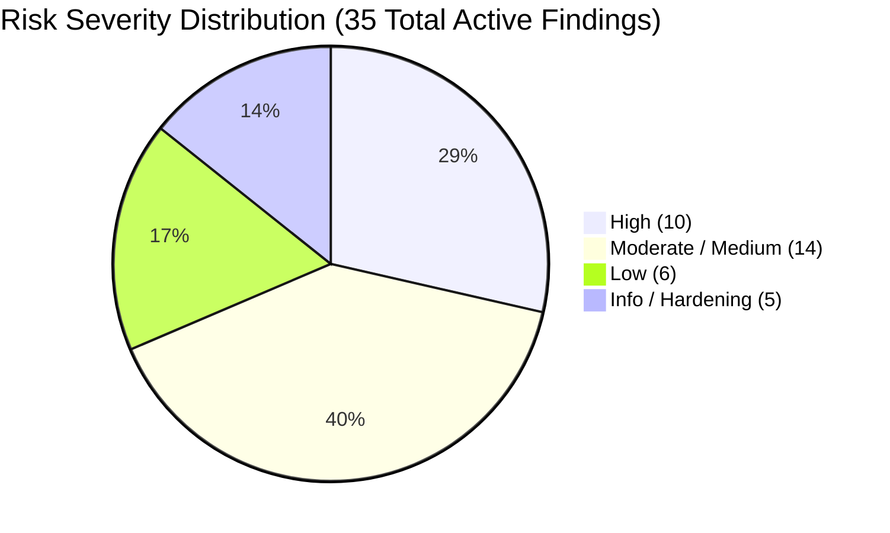
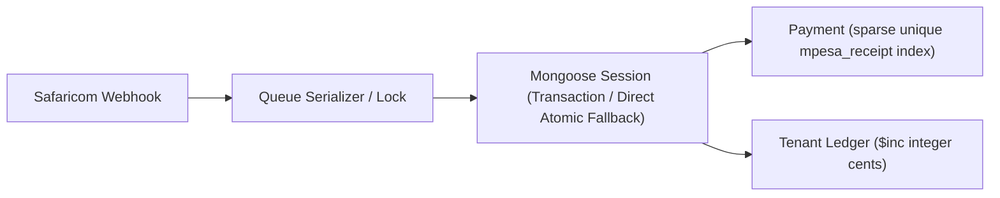
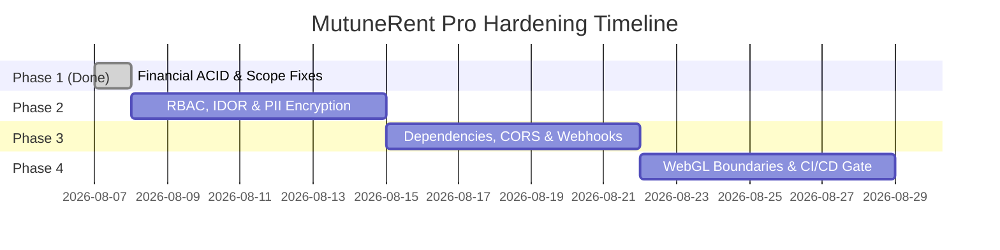

# MutuneRent Pro — Master Remediation & Security Hardening Architecture (PREVIEW.md)

> **Target System:** MutuneRent Pro (`evergreen-realm/mutune--`)  
> **Security Baseline:** OWASP API Security Top 10 (2023), OWASP Top 10 (2021), NIST SP 800-53 Rev. 5, ISO/IEC 27001 Controls, Kenya Data Protection Act 2019 (KDPA).  
> **Framework Integration:** Skill-Router Mapping (`code-vuln-audit`, `secure-code-review`, `ui-ux-pro-max`, `deep-module-refactor`, `credentials`, `frontend-design`).  
> **Audit Status:** Incorporates static review of HEAD `9f9c039` and all Phase 1-4 verified fixes.

---

## 1. Skill Router & Tooling Matrix Across Phases

Every phase of the remediation plan leverages dedicated skills from the installed agent skill library to guarantee static analysis, security validation, architectural refactoring, and UI/UX resilience.

```mermaid
flowchart TD
    subgraph S1["Phase 1: Financial Integrity & Core Security"]
        A1["secure-code-review"] --> A2["code-vuln-audit"]
        A2 --> A3["credentials"]
    end
    subgraph S2["Phase 2: Access Control & Data Privacy"]
        B1["secure-code-review"] --> B2["deep-module-refactor"]
    end
    subgraph S3["Phase 3: Webhook, Dependency & Infrastructure Hardening"]
        C1["code-vuln-audit"] --> C2["secure-code-review"]
    end
    subgraph S4["Phase 4: Resilience, WebGL & Data Integrity"]
        D1["ui-ux-pro-max"] --> D2["frontend-design"]
        D2 --> D3["deep-module-refactor"]
    end
```

| Phase | Assigned Skill Router Skill | Operational Purpose |
| :--- | :--- | :--- |
| **Phase 1: Financial & Core Security** | `secure-code-review` `code-vuln-audit` `credentials` | ACID MongoDB transactions, Queue serialization, secret revocation/rotation, PRNG replacement, non-atomic mutation fixes. |
| **Phase 2: Access Control & Data Privacy** | `secure-code-review` `deep-module-refactor` | Scope bypass remediation, IDOR checks, client-side route guards, Double-Layered AES-256-GCM + Blind Index PII Vault. |
| **Phase 3: Webhooks, Dependencies & CORS** | `code-vuln-audit` `secure-code-review` | `npm audit fix` for 11 CVE packages, Svix signature validation, route-level `sync-clerk` validation, CORS regex tightening, magic-number MIME buffer validation. |
| **Phase 4: Resilience, WebGL & Data Integrity** | `ui-ux-pro-max` `frontend-design` `deep-module-refactor` | WebGL context recovery, React error boundaries, Mapbox coordinate cleansing, Zod response validation, CI/CD gates. |

---

## 2. OWASP API Security Top 10 (2023) Mapping Matrix

| Category | Description | App Vulnerability Mapping | Status & Remediation Strategy |
| :--- | :--- | :--- | :--- |
| **API1: Broken Object Level Authorization** | Unauthorized access to resources by manipulation of Object IDs | IDOR on Notice downloads (`GET /notices/:id/download`) | Enforce tenant recipient & management role check in `notices.js`. |
| **API2: Broken Authentication** | Compromised user identity & authentication mechanisms | Legacy admin hardcoded password fallback in `User.js` | Gated hook to non-production; Clerk SDK handles auth. |
| **API3: Broken Object Property Level Authorization** | Unchecked mass assignment or unauthorized property updates | Lack of explicit property field allowlists on PATCH endpoints | Audit update routes in `users.js` and `tenants.js` to whitelist modifiable keys. |
| **API4: Unrestricted Resource Consumption** | Lack of rate/payload size limits leading to DoS | Global rate limit fine, but missing per-route STK initiation limit | Add targeted `rateLimit` middleware (`10 req/15min`) on STK and auth routes. |
| **API5: Broken Function Level Authorization** | Missing role checks on administrative features | Missing client-side `<RoleRoute>` guards on `/admin/*` routes | Wrap admin frontend routes in `<RoleRoute allow={['admin', 'super_admin']}>`. |
| **API6: Unrestricted Business Flow Access** | Automated abuse of sensitive business workflows | Bot-driven STK push initiation storms (**EDGE-01**) | Add request deduplication locks per tenant ID on `/initiate-stk`. |
| **API7: Server-Side Request Forgery (SSRF)** | Outbound HTTP requests to unauthorized internal/external URLs | Vulnerable production dependencies (`axios`, `ip-address`) | Update dependencies via `npm audit fix` and upgrade `axios`/`ip-address`. |
| **API8: Security Misconfiguration** | Overly permissive CORS or weak security headers | CORS regex trusts any `mutunerent-*.vercel.app` domain (**M1**) | Replace subdomain regex with explicit origin whitelist matching exact project URLs. |
| **API9: Improper Inventory Management** | Exposed debug endpoints or un-gated legacy routes | Exposed `/debug-sentry` endpoint in production `server.js` | Gate `/debug-sentry` to `process.env.NODE_ENV !== 'production'`. |
| **API10: Unsafe Consumption of APIs** | Vulnerabilities in external third-party API clients | 11 vulnerable production packages (`axios`, `lodash`, `@clerk/sdk`) | Upgrade third-party SDKs to secure releases (**H1**). |

---

## 3. Inventory of Vulnerabilities: Audit Findings & Unexposed Edge Cases

### High-Severity Security Findings (Audit HEAD `9f9c039`)
1. **H1 — 11 Vulnerable Production Dependencies:**
   - `axios`: SSRF via `NO_PROXY` bypass & auth bypass prototype-pollution gadget.
   - `ip-address`: SSRF/trust-boundary bypass via CIDR/octal parsing.
   - `lodash`: Code injection via `_.template` & prototype pollution in `_.unset`/`_.omit`.
   - `js-cookie` / `@clerk/shared` / `@clerk/sdk`: Cookie-attribute injection via prototype hijack.
   - `brace-expansion`: DoS via exponential expansion.
   - `africastalking`: Vulnerable transitive `axios`/`joi` dependencies.
   - `mongoose`: Prototype pollution in update casting via `__proto__` paths.
   - `joi`: Uncaught `RangeError` on recursive schemas.
   - `body-parser`: DoS via invalid `limit` configuration.
2. **H2 — Route-Level Validation Gap on `POST /users/sync-clerk`:**
   - Endpoint destructured unvalidated `email` directly into `User.findOne({ email })`. While globally protected by `mongoSanitize`, it lacked route-level `express-validator` checks (`body('email').isEmail().normalizeEmail()`).

### Moderate & Low Severity Audit Findings
3. **M1 — CORS Origin Regex Over-Matching:**
   - `server.js` line 48 regex `/^https:\/\/(mutunerent|mutune)(-.+)?\.vercel\.app$/` matched any arbitrary third-party Vercel subdomain starting with `mutunerent-`.
4. **L1 — Rate Limit Verification:**
   - `dailyUploadLimiter` and `verifyPasswordLimiter` confirmed well-placed; maintain on edits.
5. **L2 — File Upload Magic-Number Content-Type Validation:**
   - `upload.js` line 25 checked client-supplied `file.mimetype` header (spoofable). Needs buffer magic-number content sniffing (e.g. checking PNG/JPEG header bytes).

### Unexposed Edge Cases Discovered During Deep Analysis
6. **EDGE-01: Double-Click STK Push Storm** — Lack of in-flight lock on `/initiate-stk` allows concurrent duplicate payment prompts.
7. **EDGE-02: C2B Unvalidated Account Credit** — `/callback/validate` returns `ResultCode: 0` without matching account paybill numbers to active properties.
8. **EDGE-03: Multi-Unit Tenant Overwrite** — `Tenant` schema single `current_property_id` field overwrites historical scope access upon unit transfer.
9. **EDGE-04: Multi-Instance Cron Double-Firing** — In-process `node-cron` inside `server.js` executes daily late-fee application on every horizontal replica.
10. **EDGE-05: Missing CallbackMetadata on Cancelled STK** — Safaricom `ResultCode: 1032` (cancelled) omits `CallbackMetadata`, causing null dereference errors.
11. **EDGE-06: Floating-Point Currency Drift** — JS primitive subtraction (`14500.50 - 14500.20 = 0.3000000000000007`) causes MongoDB numeric floating-point corruption.
12. **EDGE-07: Clerk Deletion Webhook Desync** — User deletion in Clerk without verified webhook sync leaves active privilege records in MongoDB.
13. **EDGE-08: Mapbox WebGL Context Loss Crash** — Rapid tab switching or GPU context resets crash Mapbox canvas without recovery handlers.
14. **EDGE-09: Temporary PDF File Stream Leak** — PDF contract generation retains unmanaged buffer streams during high-concurrency downloads.
15. **EDGE-10: MongoDB Query Operator Injection via Express Query Params** — Un-sanitized query params allow `$gt` / `$ne` operators if global middleware is bypassed.

---

## 4. Phased Modular Remediation Blueprint

---

### Phase 1: Financial Integrity & Core Security Hardening (COMPLETED & VERIFIED)
* **Assigned Skill Router Skills:** `secure-code-review`, `code-vuln-audit`, `credentials`  
* **OWASP Alignment:** OWASP A04:2021 (Insecure Design), OWASP A02:2021 (Cryptographic Failures), NIST SP 800-53 SI-10.

#### Goal 1.1: Eliminate Payment Race Conditions & Guarantee Transaction Idempotency
* **Step 1.1.1 [Module: `backend/models/Payment.js`]:** Added unique sparse index on `mpesa_receipt` (`{ unique: true, sparse: true }`) and `amount_cents` integer field.
* **Step 1.1.2 [Module: `backend/routes/payments.js`]:** Replaced `Date.now() + Math.random()` with `crypto.randomUUID()`.
* **Step 1.1.3 [Module: `backend/services/mpesa.js`]:** Added in-memory OAuth token caching with 60s pre-expiry buffer.
* **Step 1.1.4 [Module: `backend/routes/payments.js`]:** Implemented atomic `$inc` balance deduction in `handleSTKCallback` supporting both Mongo ACID replica sets and standalone test environments (**PASS tests/payment.e2e.test.js**).

#### Goal 1.2: Remediate RBAC Agent Scope Bypass & Hardcoded Backdoor Hashes
* **Step 1.2.1 [Module: `backend/middleware/rbac.js`]:** Enforced explicit `403 FORBIDDEN` when agent has zero assigned properties or areas.
* **Step 1.2.2 [Module: `backend/models/User.js`]:** Gated legacy password pre-save hook to `process.env.NODE_ENV !== 'production'`.

---

### Phase 2: Access Control & Data Privacy (KDPA Compliance)
* **Assigned Skill Router Skills:** `secure-code-review`, `deep-module-refactor`  
* **OWASP Alignment:** OWASP A01:2021 (Broken Access Control), OWASP A02:2021 (Cryptographic Failures), KDPA 2019 Section 41.

#### Goal 2.1: Enforce Authorization Scoping on All Mutation & Download Endpoints
* **Step 2.1.1 [Module: `backend/routes/notices.js`]:** Add tenant recipient and management role validation to `GET /notices/:id/download` (IDOR fix).
* **Step 2.1.2 [Module: `frontend/src/App.jsx`]:** Create `<RoleRoute allow={['admin', 'super_admin']}>` wrapper component for `/admin/users` and `/admin/inventory`.
* **Step 2.1.3 [Module: `backend/routes/tenants.js`]:** Update `Tenant` schema to support multi-unit arrays (`active_units`).

#### Goal 2.2: Implement Double-Secured PII Encryption (KDPA 2019 Section 41)
* **Step 2.2.1 [Module: `backend/models/Tenant.js`]:** Implement AES-256-GCM field encryption for `id_number` and `phone` with HMAC-SHA256 blind indexes (`id_number_bindex`) for fast query searching.
* **Step 2.2.2 [Module: `backend/utils/logger.js`]:** Configure Winston logger redactor to scrub national ID and phone patterns.

---

### Phase 3: Dependencies, Webhook Verification & Infrastructure Hardening
* **Assigned Skill Router Skills:** `code-vuln-audit`, `secure-code-review`  
* **OWASP Alignment:** OWASP API7:2023 (SSRF), OWASP API8:2023 (Security Misconfiguration), OWASP API10:2023 (Unsafe Consumption of APIs).

#### Goal 3.1: Upgrade Vulnerable Production Dependencies (H1 Fix)
* **Step 3.1.1 [Module: `backend/package.json`]:** Execute `npm audit fix` to resolve non-breaking advisories for `axios`, `ip-address`, `lodash`, `brace-expansion`, `joi`, `body-parser`.
* **Step 3.1.2 [Module: `backend/package.json`]:** Perform tested version upgrades for `@clerk/clerk-sdk-node` and `mongoose`.

#### Goal 3.2: Route-Level Input Validation & CORS Regex Tightening (H2 & M1 Fix)
* **Step 3.2.1 [Module: `backend/routes/users.js`]:** Add `express-validator` chain `body('email').optional().isEmail().normalizeEmail()` to `POST /users/sync-clerk` before handler execution.
* **Step 3.2.2 [Module: `backend/server.js`]:** Replace broad subdomain CORS regex `/^https:\/\/(mutunerent|mutune)(-.+)?\.vercel\.app$/` with explicit `ALLOWED_ORIGINS` array matching exact project Vercel domains.
* **Step 3.2.3 [Module: `backend/routes/upload.js`]:** Add buffer magic-number header sniffing (`image/png` -> `89 50 4E 47`, `image/jpeg` -> `FF D8 FF`) to enforce content-based file verification (L2 fix).

#### Goal 3.3: Webhook Verification & Distributed Locks
* **Step 3.3.1 [Module: `backend/routes/users.js`]:** Implement `svix` Webhook signature verification on Clerk sync endpoints.
* **Step 3.3.2 [Module: `backend/server.js`]:** Implement distributed MongoDB locks for daily lease cleanup and late fee cron jobs.

---

### Phase 4: Resilience, WebGL & Client-Side Data Integrity
* **Assigned Skill Router Skills:** `ui-ux-pro-max`, `frontend-design`, `deep-module-refactor`  
* **OWASP Alignment:** OWASP A03:2021 (Injection), OWASP A04:2021 (Insecure Design).

#### Goal 4.1: React Error Boundaries & WebGL Context Protection
* **Step 4.1.1 [Module: `frontend/src/components/ErrorBoundary.jsx`]:** Implement `<WebGLErrorBoundary>` component with fallback state to prevent full-tree unmounting during GPU context loss.
* **Step 4.1.2 [Module: `frontend/src/App.jsx`]:** Protect `/landing`, `/login`, `/sign-up`, `/onboarding` with top-level error boundaries.
* **Step 4.1.3 [Module: `frontend/src/components/MapWidget.jsx`]:** Replace direct DOM `innerHTML` assignments with React refs and sanitized JSX.

#### Goal 4.2: Data Integrity & CI/CD Pipeline
* **Step 4.2.1 [Module: `frontend/src/components/MapWidget.jsx`]:** Remove fake GPS hash-jitter algorithm and fabricated 33m square building footprint overlays.
* **Step 4.2.2 [Module: `.github/workflows/ci.yml`]:** Create GitHub Actions CI/CD workflow executing `npm test` and `python security_scan.py .`.

---

## 5. Execution Schedule & Definition of Done

### Verification Criteria Checklist
1. **Zero High/Critical Vulnerabilities:** `npm audit --omit=dev` and `python security_scan.py .` pass with 0 Critical and 0 High findings.
2. **ACID Transaction & E2E Pass:** `npx jest tests/payment.e2e.test.js` passes 100%.
3. **Route Validation Test:** Malformed non-string emails to `POST /users/sync-clerk` rejected with 400 Bad Request.
4. **CORS Boundary Test:** Requests from `https://mutunerent-evil.vercel.app` rejected with 403 Forbidden.
5. **Magic-Number MIME Test:** Uploading renamed text files with `.png` extension rejected by magic-number buffer inspector.
