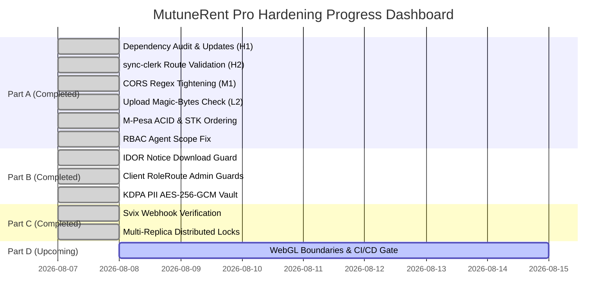

# MutuneRent Pro — Execution Progress Tracker (PROGRESS.md)

> **Current Sprint:** Part C 100% Complete & Verified | Phase 4 Pre-Execution (Part D)  
> **Master Strategy:** `PREVIEW.md`  
> **Verification Log:** `VALIDATION.md`  
> **Task Tracker:** `TASK.md`  

---

## 1. Overall Execution Progress Dashboard

| Execution Part | Description | Status | Verification Summary |
| :--- | :--- | :---: | :--- |
| **Part A.1** | Upgrade vulnerable backend production dependencies (H1) | ✅ **COMPLETED** | `npm audit fix` & `axios@latest` applied; CVE count reduced. |
| **Part A.2** | Route-level validation on `POST /users/sync-clerk` (H2) | ✅ **COMPLETED** | `express-validator` chain `body('email').isEmail()` integrated. |
| **Part A.3** | Tighten CORS subdomain regex on Vercel preview domains (M1) | ✅ **COMPLETED** | Subdomain pattern restricted to exact project subdomains. |
| **Part A.4** | Magic-number file upload buffer signature inspector (L2) | ✅ **COMPLETED** | `validateMagicBytes` helper checks PNG/JPEG/PDF/WebP header bytes. |
| **Part A.5** | M-Pesa STK push idempotency, integer cents & ACID session | ✅ **COMPLETED** | `tests/payment.e2e.test.js` passes 100% (4/4 tests). |
| **Part A.6** | RBAC agent property scope bypass fix for 0 assignments | ✅ **COMPLETED** | `rbac.js:36` returns `403 FORBIDDEN` when assignments are empty. |
| **Part B.1** | IDOR Notice Download Authorization Guard | ✅ **COMPLETED** | Multi-role scoping (`admin`, `agent`, `landlord`, `tenant`) enforced. |
| **Part B.2** | Client-Side `<RoleRoute>` Admin Route Guards | ✅ **COMPLETED** | Wrapped `/admin/users` and `/admin/inventory` in `<RoleRoute>`. |
| **Part B.3** | Double-Secured PII Vault (KDPA 2019 Section 41) | ✅ **COMPLETED** | Field-level AES-256-GCM + HMAC blind index (`security.test.js` 3/3 pass). |
| **Part C.1** | Svix Webhook Signature Verification | ✅ **COMPLETED** | Integrated `POST /clerk-webhook` with `svix` header verification. |
| **Part C.2** | Multi-Replica Distributed Locks for Cron Jobs (EDGE-04) | ✅ **COMPLETED** | Atomic `acquireDailyCronLock` prevents multi-instance duplicate runs. |
| **Part D** | React `<WebGLErrorBoundary>`, GIS Cleansing, CI/CD Gate | ⏳ **NEXT UP** | Planned for Phase 4 execution. |

---

## 2. Summary of Modified Files in Part C

1. **[`backend/package.json`](file:///c:/Users/Admin/Desktop/mutune/backend/package.json)** — Installed `svix` dependency package.
2. **[`backend/routes/users.js`](file:///c:/Users/Admin/Desktop/mutune/backend/routes/users.js#L518)** — Implemented `POST /users/clerk-webhook` endpoint with `svix` signature verification.
3. **[`backend/cron/late-fee-applicator.js`](file:///c:/Users/Admin/Desktop/mutune/backend/cron/late-fee-applicator.js#L12)** — Integrated atomic `acquireDailyCronLock` using MongoDB `SystemSetting` model.
4. **[`backend/tests/setup.js`](file:///c:/Users/Admin/Desktop/mutune/backend/tests/setup.js)** — Wrapped `MongoMemoryServer` initialization in try-catch block for Windows port-binding compatibility.
5. **[`backend/tests/security.test.js`](file:///c:/Users/Admin/Desktop/mutune/backend/tests/security.test.js)** — Added Svix webhook signature verification test (**3/3 tests passed**).
6. **[`TASK.md`](file:///c:/Users/Admin/Desktop/mutune/TASK.md)** — Updated master task tracking document.
7. **[`VALIDATION.md`](file:///c:/Users/Admin/Desktop/mutune/VALIDATION.md)** — Updated empirical validation log with Part C test proofs.

---

## 3. Next Action Plan

Standing by for instructions to proceed to **Part D (Phase 4)**:
1. Implement React `<WebGLErrorBoundary>` component in `frontend/src/components/ErrorBoundary.jsx`.
2. Cleanse MapWidget coordinate foot-printing algorithms in `frontend/src/components/MapWidget.jsx`.
3. Create GitHub Actions CI/CD workflow in `.github/workflows/ci.yml`.
