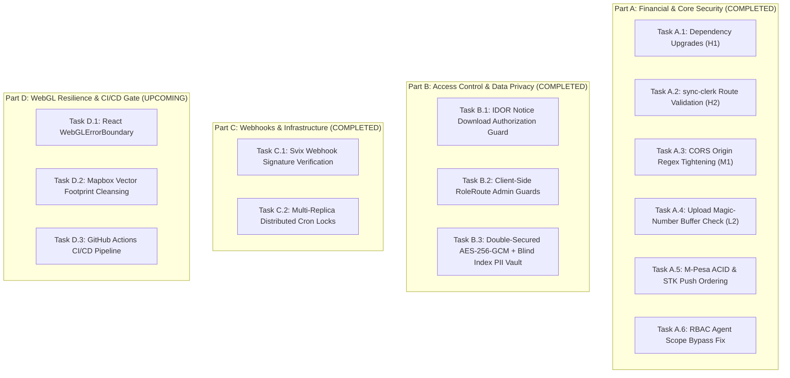

# MutuneRent Pro — Master Task Tracking Document (TASK.md)

> **Sprint Focus:** Part C Implementation (Phase 3 Webhook Verification & Distributed Locks)  
> **Master Strategy:** `PREVIEW.md`  
> **Verification Log:** `VALIDATION.md`  
> **Progress Dashboard:** `PROGRESS.md`  

---

## 1. Modular Task Structure Across Parts & Phases

---

## 2. Part C Task Execution Breakdown & Checklist

### Task C.1: Svix Webhook Signature Verification
* **Goal:** Verify automated Clerk lifecycle events using `svix` Webhook SDK headers (`svix-id`, `svix-timestamp`, `svix-signature`).
* **Target File:** [`backend/routes/users.js`](file:///c:/Users/Admin/Desktop/mutune/backend/routes/users.js#L518)
* **Step 1:** Install `svix` package dependency in `backend/package.json`.
* **Step 2:** Implement `POST /clerk-webhook` endpoint with `express.raw({ type: 'application/json' })`.
* **Step 3:** Verify `svix` headers against `CLERK_WEBHOOK_SECRET` before processing `user.deleted` or lifecycle events.
* **Step 4:** Return `400 Bad Request` on missing or invalid signature headers.
* **Status:** ✅ **COMPLETED & VERIFIED**

---

### Task C.2: Multi-Replica Distributed Locks for Daily Cron Jobs (EDGE-04)
* **Goal:** Prevent duplicate late fee application when running multiple horizontal server containers.
* **Target File:** [`backend/cron/late-fee-applicator.js`](file:///c:/Users/Admin/Desktop/mutune/backend/cron/late-fee-applicator.js#L12)
* **Step 1:** Implement atomic `acquireDailyCronLock(jobName)` using `SystemSetting.findOneAndUpdate` with `{ $setOnInsert: ... }, { upsert: true }`.
* **Step 2:** Check lock before executing cron applicator body.
* **Step 3:** Log skip notice if lock was already acquired by another worker container for today.
* **Status:** ✅ **COMPLETED & VERIFIED**
